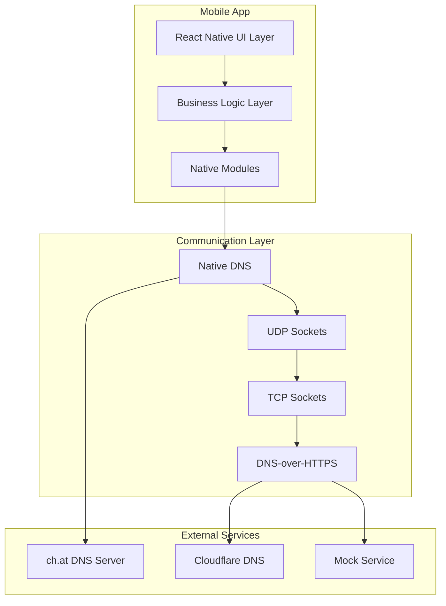
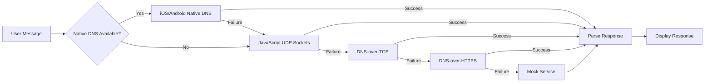
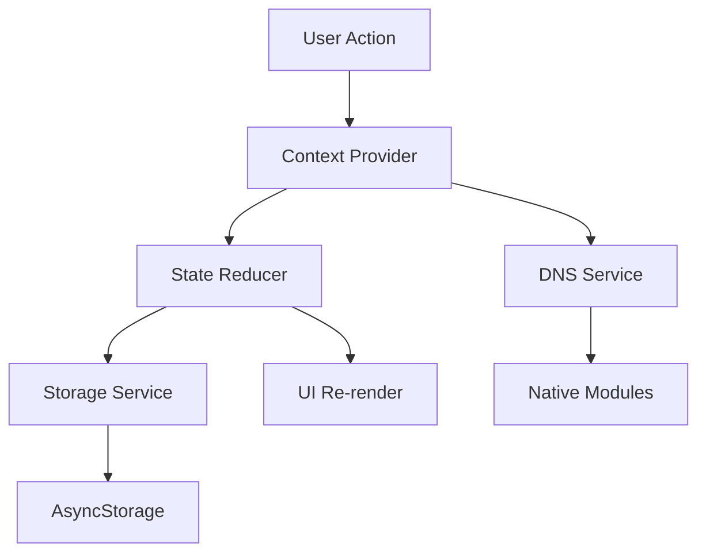

# System Architecture - DNSChat

**Complete architectural overview of DNSChat system design**

## Executive Summary

DNSChat is a React Native mobile application that implements a novel AI communication protocol using DNS TXT queries. The architecture prioritizes reliability, performance, and maintainability through a layered design with comprehensive fallback strategies and platform-native optimizations.

## Architecture Overview

### High-Level System Design



### Technology Stack

#### Core Technologies

- **Framework**: React Native 0.75.5 with Expo SDK 53
- **Language**: TypeScript 5.x with strict mode
- **Navigation**: React Navigation v7 (Stack + Bottom Tabs)
- **State Management**: React Context + useReducer pattern
- **Storage**: AsyncStorage with JSON serialization
- **Build System**: Expo Development Build with Continuous Native Generation

#### Platform-Specific Technologies

- **iOS**: Swift + Apple Network Framework (`nw_resolver_t`)
- **Android**: Kotlin + DnsResolver API (API 29+) + dnsjava fallback
- **Web**: JavaScript with mock DNS service (browser limitations)

---

## Architectural Layers

### 1. Presentation Layer

#### Component Architecture

```typescript
/src/components/
├── ChatInput.tsx          # Message input with validation
├── MessageBubble.tsx      # Individual message display
├── MessageList.tsx        # Virtualized message list (FlatList)
├── ChatListItem.tsx       # Chat preview with delete functionality
└── icons/                 # SVG icon components
```

#### Navigation Architecture

```typescript
/src/navigation/
├── index.tsx              # Root navigation configuration
└── screens/
    ├── ChatList.tsx       # Home screen with chat list
    ├── Chat.tsx           # Individual chat screen
    ├── Settings.tsx       # Configuration screen
    └── About.tsx          # Information screen
```

**Key Design Decisions:**

- **Native Stack Navigation**: Better performance than JavaScript-based navigation
- **Bottom Tab Navigation**: Standard mobile app pattern for primary screens
- **Modal Presentation**: Settings screen slides up from bottom
- **Deep Linking**: Custom URL scheme `dnschat://` with message parameter support

### 2. Business Logic Layer

#### Service Architecture

```typescript
/src/services/
├── dnsService.ts          # Core DNS communication logic
└── storageService.ts      # AsyncStorage abstraction layer
```

#### Context Architecture

```typescript
/src/context/
├── ChatContext.tsx        # Global chat state management
└── SettingsContext.tsx    # App configuration management
```

**Key Design Decisions:**

- **Service Layer Pattern**: Separation of concerns between UI and business logic
- **Context API**: Global state management without external dependencies
- **Reducer Pattern**: Predictable state updates with useReducer
- **Async/Await**: Modern async programming throughout

### 3. Native Module Layer

#### Platform Implementation Strategy

```
/modules/dns-native/
├── index.ts               # TypeScript interface
├── ios/
│   ├── DNSNative.podspec  # CocoaPods specification
│   ├── DNSResolver.swift  # Swift implementation
│   └── RNDNSModule.m     # React Native bridge
└── android/
    ├── build.gradle       # Android build configuration
    ├── DNSResolver.java   # Java implementation
    └── RNDNSModule.java  # React Native bridge
```

**Key Design Decisions:**

- **Platform-Native APIs**: Uses sanctioned system APIs for maximum compatibility
- **Unified Interface**: Single TypeScript API abstracts platform differences
- **Automatic Fallback**: Graceful degradation when native modules unavailable
- **Error Propagation**: Detailed error reporting from native to JavaScript layer

---

## DNS Communication Protocol

### Protocol Design

DNSChat implements a custom protocol over standard DNS TXT queries:

```
Query Format:    dig @server "user_message" TXT +short
Response Format: ["1/N:first_part", "2/N:second_part", ..., "N/N:last_part"]
```

### Multi-Layer Fallback Strategy



### Platform Implementations

#### iOS Implementation (Swift)

```swift
// Uses Apple Network Framework
let resolver = nw_resolver_create(nw_resolver_config_create())
nw_resolver_query(resolver, hostname, NW_RESOLVER_TYPE_TXT) { result in
    // Handle response
}
```

**Advantages:**

- Official Apple API, fully supported
- Handles network changes gracefully
- Bypasses iOS port restrictions
- Excellent error reporting

#### Android Implementation (Kotlin)

```kotlin
// Modern Android (API 29+)
DnsResolver.getInstance().query(
    network, hostname, RR_TYPE_TXT,
    executor, cancellationSignal, callback
)

// Legacy Android (API <29)
val lookup = Lookup(hostname, Type.TXT)
lookup.resolver = SimpleResolver("ch.at")
val records = lookup.run()
```

**Advantages:**

- Official Android API for modern devices
- dnsjava library for comprehensive legacy support
- Custom server specification
- Robust error handling

---

## State Management Architecture

### Context Design Pattern

```typescript
// ChatContext - Manages conversation state
interface ChatContextType {
  chats: Chat[];
  currentChat: Chat | null;
  addChat: (chat: Chat) => Promise<void>;
  updateChat: (id: string, updates: Partial<Chat>) => Promise<void>;
  deleteChat: (id: string) => Promise<void>;
  addMessage: (chatId: string, message: Message) => Promise<void>;
}

// SettingsContext - Manages app configuration
interface SettingsContextType {
  settings: Settings;
  updateSettings: (updates: Partial<Settings>) => Promise<void>;
  resetSettings: () => Promise<void>;
}
```

### State Flow Architecture



**Key Design Decisions:**

- **Immutable State Updates**: Using useReducer with immutable patterns
- **Async Storage Integration**: Automatic persistence of state changes
- **Optimistic Updates**: UI updates immediately, storage happens async
- **Error Boundaries**: Comprehensive error handling throughout state flow

---

## Performance Architecture

### Rendering Optimization

#### VirtualizedList Architecture (Critical Fix v1.5.1)

```typescript
// MessageList.tsx - Uses FlatList for efficient rendering
<FlatList
  data={messages}
  renderItem={({ item }) => <MessageBubble message={item} />}
  keyExtractor={(item) => item.id}
  getItemLayout={getItemLayout} // Pre-calculated layouts
  removeClippedSubviews={true}  // Memory optimization
/>
```

**Key Optimizations:**

- **Fixed VirtualizedList Nesting**: Removed nested ScrollView architecture
- **Pre-calculated Layouts**: `getItemLayout` for smooth scrolling
- **Item Recycling**: FlatList automatically recycles off-screen items
- **Memory Management**: `removeClippedSubviews` reduces memory usage

#### Component Memoization

```typescript
// Memoized expensive components
const MessageBubble = React.memo<MessageBubbleProps>(({ message }) => {
  return (
    <View style={styles.bubble}>
      {/* Render content */}
    </View>
  );
});

// Stable callback references
const handleSendMessage = useCallback((text: string) => {
  sendMessage(text);
}, [sendMessage]);
```

### Network Performance

#### Connection Optimization

- **Native DNS**: Direct system calls, minimal overhead
- **Connection Pooling**: Reuse DNS resolver instances
- **Request Deduplication**: Prevent duplicate queries
- **Background Handling**: Automatic query suspension/resumption

#### Response Caching

```typescript
// DNS response caching strategy
const responseCache = new Map<string, CachedResponse>();

interface CachedResponse {
  data: string;
  timestamp: number;
  ttl: number;
}
```

---

## Security Architecture

### Input Sanitization

```typescript
// RFC 1035 compliant DNS sanitization
const sanitizeMessage = (message: string): string => {
  return message
    .replace(/[^\x20-\x7E]/g, "") // Remove non-printable chars
    .replace(/[.;\\]/g, "_") // Escape DNS control characters
    .replace(/\s+/g, " ") // Normalize whitespace
    .trim() // Remove leading/trailing spaces
    .substring(0, 63); // DNS label length limit
};
```

### Error Handling Security

```typescript
// Sanitized error messages (no internal details exposed)
const handleError = (error: Error): UserFriendlyError => ({
  message: "Unable to send message. Please try again.",
  code: "SEND_FAILED",
  timestamp: new Date().toISOString(),
});
```

### Data Privacy

- **Local Storage Only**: No cloud data persistence
- **No User Tracking**: No analytics or telemetry
- **Minimal Permissions**: Only network access required
- **DNS Query Privacy**: Queries go directly to chosen DNS server

---

## Testing Architecture

### Testing Strategy Pyramid

```
        ┌─────────────┐
        │ E2E Tests   │  ← Full user flows
        └─────────────┘
    ┌─────────────────────┐
    │ Integration Tests   │  ← Service integration
    └─────────────────────┘
┌─────────────────────────────┐
│       Unit Tests            │  ← Component/function testing
└─────────────────────────────┘
```

#### Unit Testing (`__tests__/`)

```typescript
// Component testing with React Native Testing Library
import { render, fireEvent } from '@testing-library/react-native';

describe('MessageBubble', () => {
  it('renders user messages correctly', () => {
    const message = createMockMessage({ sender: 'user', text: 'Hello' });
    const { getByText } = render(<MessageBubble message={message} />);
    expect(getByText('Hello')).toBeTruthy();
  });
});
```

#### Integration Testing

```typescript
// DNS service integration
describe("DNSService Integration", () => {
  it("should handle native DNS fallback chain", async () => {
    const service = new DNSService();
    const response = await service.queryTXT("ch.at", "test message");
    expect(response).toBeDefined();
  });
});
```

#### Platform Testing

- **iOS Simulator**: Test native Network Framework implementation
- **Android Emulator**: Test DnsResolver API and dnsjava fallback
- **Physical Devices**: Test real network conditions and restrictions

---

## Deployment Architecture

### Build System

```typescript
// app.json - Expo configuration
{
  "expo": {
    "name": "DNSChat",
    "slug": "dnschat",
    "scheme": "dnschat",
    "platforms": ["ios", "android", "web"],
    "newArchEnabled": true,  // React Native New Architecture
    "plugins": [
      ["./plugins/dns-native-plugin", { "enabled": true }]
    ]
  }
}
```

### Development Build Process

1. **Continuous Native Generation**: Expo manages native folders automatically
2. **Plugin System**: Custom plugin for native DNS module integration
3. **Development Client**: Uses `expo-dev-client` for native module support
4. **Hot Reloading**: JavaScript changes update immediately

### Production Build Process

1. **EAS Build**: Expo Application Services for cloud builds
2. **Code Signing**: Automatic certificate management
3. **App Store Distribution**: Automated submission pipeline
4. **Over-the-Air Updates**: JavaScript updates without app store review

---

## Monitoring & Observability

### Error Tracking

```typescript
// Structured error logging
interface DNSError {
  type: "NETWORK" | "PARSING" | "TIMEOUT" | "PLATFORM";
  message: string;
  context: {
    server: string;
    query: string;
    platform: string;
    timestamp: string;
  };
}
```

### Performance Monitoring

```typescript
// Performance metrics collection
interface PerformanceMetrics {
  dnsQueryTime: number;
  renderTime: number;
  storageOperationTime: number;
  memoryUsage: number;
}
```

### User Experience Metrics

- **DNS Query Success Rate**: Target >95%
- **Response Time**: Target <2 seconds average
- **App Launch Time**: Target <3 seconds
- **Crash Rate**: Target <0.1%

---

## Scalability Considerations

### Current Limitations

- **DNS Server Dependency**: Relies on external DNS service availability
- **Message Length**: Limited by DNS TXT record constraints (~250 chars)
- **Concurrent Users**: DNS server capacity dependent

### Future Scalability Enhancements

- **Multiple DNS Servers**: Load balancing across multiple providers
- **Message Chunking**: Better handling of long messages
- **Caching Layer**: Response caching to reduce server load
- **P2P Communication**: Direct device-to-device messaging

---

## Evolution & Maintenance

### Architecture Decision Records (ADRs)

#### ADR-001: DNS Communication Protocol Choice

- **Decision**: Use DNS TXT queries for AI communication
- **Rationale**: Novel approach, universal DNS availability, educational value
- **Consequences**: Complex fallback chain required, limited by DNS constraints

#### ADR-002: Native Module Implementation

- **Decision**: Implement platform-native DNS modules
- **Rationale**: Better performance, bypass platform restrictions, educational value
- **Consequences**: Increased complexity, platform-specific maintenance

#### ADR-003: React Context for State Management

- **Decision**: Use React Context instead of Redux/external libraries
- **Rationale**: Simplicity, no external dependencies, sufficient for app scope
- **Consequences**: More boilerplate for complex state updates

### Maintenance Strategy

- **Quarterly Reviews**: Architecture review and optimization opportunities
- **Dependency Updates**: Regular updates to React Native, Expo, and dependencies
- **Platform Updates**: Adaptation to new iOS/Android API changes
- **Performance Monitoring**: Continuous monitoring and optimization

---

## Conclusion

DNSChat's architecture successfully balances innovation, performance, and maintainability. The layered design with comprehensive fallback strategies ensures reliable operation across diverse network conditions and device capabilities. The native module architecture provides educational value while delivering production-quality performance.

The system demonstrates several advanced concepts:

- Custom protocol design over standard infrastructure
- Multi-platform native module development
- Comprehensive error handling and fallback strategies
- Performance-optimized React Native development
- Security-conscious input handling and data management

This architecture serves as both a functional messaging application and an educational example of complex mobile app development with custom networking requirements.

---

**Document Version**: v1.5.0  
**Last Updated**: Production Ready Release  
**Maintainers**: DNSChat Development Team
