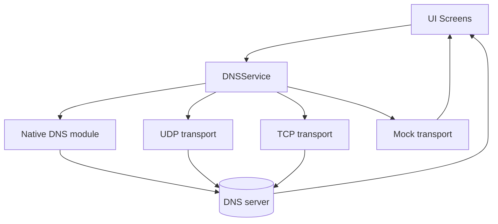

# System architecture

DNSChat is a React Native app (Expo dev-client) that turns a short prompt into a
DNS TXT query and renders the TXT response as chat output.

Current stack (from `package.json`):

- React Native `0.83.2` + React `19.2.0`
- Expo SDK `55.0.0`
- TypeScript `5.9.2`
- Navigation: Expo Router (file-based routing) with React Navigation stacks/tabs

## High-level data flow

Transport order is implemented in `src/services/dnsService.ts`.

## Key code locations

App:

- `app/_layout.tsx` root providers + router stack
- `app/(tabs)/_layout.tsx` tab navigation
- `app/chat/[threadId].tsx` chat route wrapper
- `src/services/dnsService.ts` query pipeline + fallback order + parsing
- `src/services/dnsLogService.ts` logging model used by the Logs screen (redacted + encrypted at rest)
- `src/services/storageService.ts` AsyncStorage persistence (encrypted at rest)

Native DNS module:

- `modules/dns-native/` shared TS API + iOS/Android bridge code
- `ios/DNSNative/` iOS native module project files used by Expo prebuild

## DNS query pipeline (what matters)

1. Validate prompt (reject empty/whitespace/control chars).
2. Enforce max prompt length before sanitization (`120` chars).
3. Sanitize into a single DNS label (lowercase, replace whitespace with `-`,
   remove invalid, enforce 63-char DNS label limit).
4. Compose query name `label.<zone>` and send it via the transport chain.
5. Validate DNS response headers (native UDP) before parsing:
   - Transaction ID match, QR/opcode/TC/RCODE checks, QDCOUNT=1.
   - Question section matches QNAME/QTYPE/QCLASS.
6. Parse TXT response:
   - Plain TXT records: concatenate non-empty records and return.
   - Multipart `n/N:` records: require a complete set `1..N` and join in order.

The reference constants live in `modules/dns-native/constants.ts`.

## DNS-over-HTTPS notes

- Web builds cannot do raw DNS to a custom server on port 53, so Web uses Mock.
- The TypeScript transport chain does not implement DNS-over-HTTPS; `tcp` is
  DNS-over-TCP on port 53.
- Android native DNS has its own internal fallback: raw UDP first, then
  DNS-over-HTTPS for non-LLM servers, then a legacy resolver (dnsjava).
  See `modules/dns-native/android/DNSResolver.java`.
