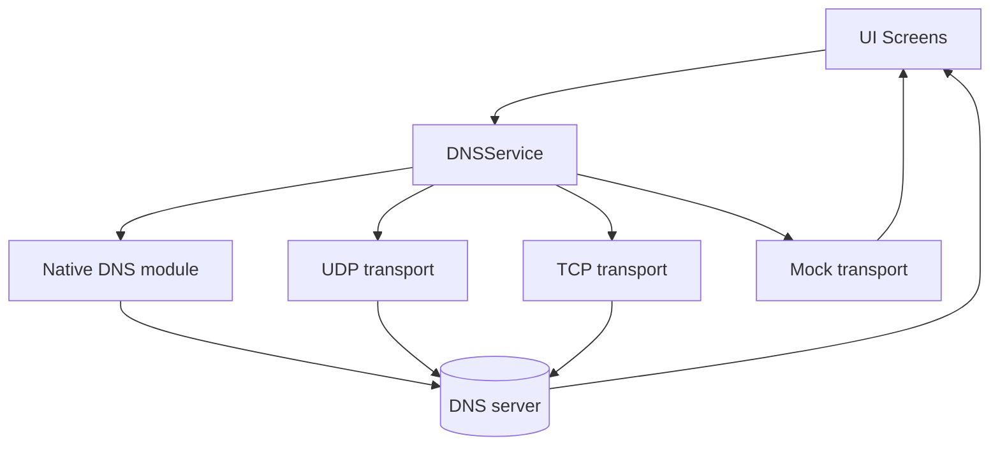

# System architecture

DNSChat is a React Native Expo app that turns a short prompt into a
DNS TXT query and renders the TXT response as chat output.

Current stack (from `package.json`):

- React Native `0.86.3` + React `19.2.3`
- Expo SDK `57.0.x`
- TypeScript `6.0.3`
- Navigation: Expo Router (file-based routing) with native tabs and router-managed stacks

## High-level data flow

```mermaid
graph TB
  UI[UI Screens] --> SVC[DNSService]
  SVC --> NATIVE[Native DNS module]
  SVC --> UDP[UDP transport]
  SVC --> TCP[TCP transport]
  SVC --> MOCK[Mock transport]
  NATIVE --> DNS[(DNS server)]
  UDP --> DNS
  TCP --> DNS
  MOCK --> UI
  DNS --> UI
```

Transport order is implemented in `src/services/dnsService.ts`.

## Key code locations

App:

- `app/_layout.tsx` root providers + router stack
- `app/(tabs)/_layout.tsx` tab navigation
- `app/chat/[threadId].tsx` chat route wrapper
- `src/services/dnsService.ts` query orchestration + fallback order + retries/logging
- `src/services/dnsWire.ts` DNS wire format: TXT query encoding, packet decoding, TCP framing, TXT extraction, decoded-response validation
- `src/services/dnsLogService.ts` logging model used by the Logs screen (redacted + encrypted at rest)
- `src/services/storageService.ts` AsyncStorage persistence (encrypted at rest)
- Android SecureStore backup/device-transfer exclusion rules live in
  `android/app/src/main/res/xml/`.

Native DNS module:

- `modules/dns-native/` shared TS API and source-of-truth iOS/Android bridge code.
- `ios/DNSNative/` tracked iOS prebuild copy; resolver changes must stay synchronized with `modules/dns-native/ios/` and are checked by `pnpm run verify:dnsresolver-sync`.

## DNS query pipeline (what matters)

1. Validate prompt (reject empty/whitespace/control chars).
2. Enforce max prompt length before sanitization (`120` chars).
3. Sanitize into a single DNS label (lowercase, replace whitespace with `-`,
   remove invalid, enforce 63-char DNS label limit).
4. Compose query name `label.<zone>` and send it via the transport chain.
   One absolute 20-second deadline covers every resolver, retry, backoff, and
   transport; each rung is capped at the smaller of 10 seconds or the remaining
   budget.
5. Validate DNS response headers before parsing:
   - Transaction ID match, QR/opcode/TC/RCODE checks, QDCOUNT=1.
   - Question section matches QNAME/QTYPE/QCLASS.
   - TXT answer owner name and class match the original query.
6. Parse TXT response:
   - Plain TXT records: concatenate non-empty records and return.
   - Multipart `n/N:` records: require a complete set `1..N` and join in order.

The reference constants live in `modules/dns-native/constants.ts`. Shared
TypeScript wire-format helpers live in `src/services/dnsWire.ts` so UDP and TCP
adapters use the same packet, framing, validation, and TXT extraction rules.
Native code converts the caller's epoch deadline once to a monotonic deadline
and caps its work at 9.5 seconds. When the app enters the background, the
current lifecycle is invalidated: native work is cancelled, JavaScript sockets
are closed, and late results cannot start a fallback or reach the UI after a
foreground transition.

## DNS-over-HTTPS notes

- Web builds cannot do raw DNS to a custom server on port 53, so Web uses Mock.
- The TypeScript transport chain does not implement DNS-over-HTTPS; `tcp` is
  DNS-over-TCP on port 53.
- Android native DNS has its own internal fallback: the platform resolver
  first, then a legacy resolver (dnsjava). The DNS-over-HTTPS rung was removed
  in 4.4.0 -- the native resolver speaks only DNS, so no query leaves the
  device over HTTPS to a third party.
  See `modules/dns-native/android/DNSResolver.java`.
- Native DNS (both platforms) is deliberately stricter than the JavaScript
  layer: it compiles in only the LLM zones (never a public recursive
  resolver), accepts only port 53, and pins each query name to the selected
  resolver's zone.
- Consequence of that asymmetry: an IP resolver such as `8.8.8.8` makes the
  native rung reject the query, and the chain continues to UDP then TCP, which
  still accept it. The Settings picker offers only the two LLM hostnames, so an
  IP resolver arrives only from a setting an older install persisted
  (`migrateSettings` keeps it and `validateDNSServer` still accepts it).
- With **Allow Experimental Transports** off the order is native-only, so such
  a stored IP resolver is retried `MAX_RETRIES` times and then fails with
  "Native DNS is enforced" -- unless **Mock DNS** is also on, in which case the
  appended mock rung answers instead.
